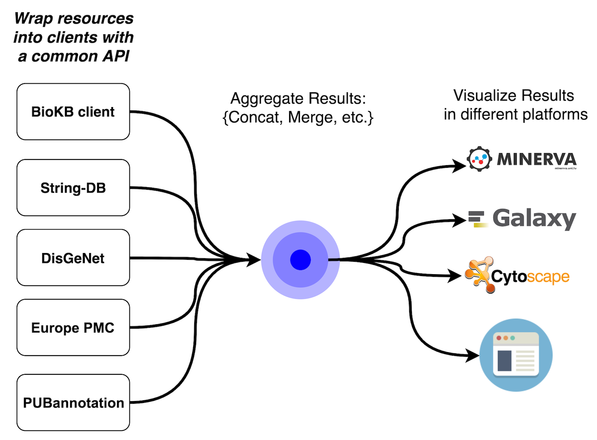

# Text-mining and semantic web technologies

## Authors

### LCSB, University of Luxembourg 
Venkata Satagopam (0000-0002-6532-5880)
Carlos Vega (0000-0002-7979-9921)
Valentin Grouès (0000-0001-6501-0806)

### Novo Nordisk Foundation Center for Protein Research
Lars Juhl Jensen (0000-0001-7885-715X)

### European Bioinformatics Institute
Aravind Venkatesan (0000-0003-4019-1940)

### Google, UK
Margarita Kopniczky (0000-0002-4792-1355)

### Radboud University Medical Center
Gurnoor Singh

## Abstract

## Introduction

The tremendous growth of scientific publications [1] provides challenges for researchers and curators for finding and assimilating scientific conclusions described in the literature. 
To this end, text mining pipelines facilitate the extraction of scientific assertions together with their biological context. 
This process comprises of several challenging tasks such as part-of-speech tagging, entity normalisation, or event extraction, which are essential to discover relevant knowledge in the form of entities, relations and events. 
During this biohackathon project, we focused on further integration, interoperability and accessibility of different text-mining knowledge repositories with well-defined APIs to facilitate construction of gene/protein networks and disease maps and annotation of bio-entities, relationships and events within these networks and maps.

The outcome of this project is twofold. On one side it will help curators and researchers improve they knowledge pipelines through a common-inter-resource API, browsing information [BioKB], annotating interactions [BioKC] and constructing disease map models [Minerva]. 
On the other side it will also feedback each of the constituent resources which will benefit from this open and collaborative integration process. 
To this end, the very first step of the project was to study the capabilities of these resources in terms of content and interoperability and note their assets and handicaps. 
The last european Biohackathon in Paris provided us a priviledged stand to undertake the project in company with field experts. 

### State of the art (to be improved)

Hereafter we tackle some of the particularities of some of the most important knowledge bases available. 
For the sake of brevity we also summarised them in the following table.

[...] (extend SoA)

|               	| Aim                                                                                                                                                                  	| Size                                                        	| Handicaps            	| Assets            	| Coverage 	|
|---------------	|----------------------------------------------------------------------------------------------------------------------------------------------------------------------	|-------------------------------------------------------------	|----------------------	|-------------------	|:--------:	|
| BioKB         	| Helps researchers easily access semantic content of thousands of abstracts and full text articles.                                                                   	| 24M abstracts, 5.3 full text articles                       	|                      	| SparQL endpoint   	|          	|
| String-DB     	| Known and predicted protein-protein interactions.                                                                                                                    	| 9.6M proteins from 2K organisms.                            	|                      	| Fast and rich API 	|          	|
| PMC Europe    	| Provides text mining annotations contained in abstracts and open access full text articles                                                                           	| 36.2M abstracts, 5.7 articles                               	| API is slow          	| Huge content      	|          	|
| DisGeNET      	| Discovery platform for genes and variants associated to human diseases                                                                                               	| 628K GDAs 210K VDAs 62M triples                             	|                      	|                   	|     -    	|
| PubAnnotation 	| Repository of text annotations                                                                                                                                       	| 12M articles                                                	| Complex organization 	|                   	|     -    	|
| PubCaseFinder 	| Phenotype-driven differential diagnosis system                                                                                                                       	| 7K Genetic Diseases 4.6K Rare Diseases from 2M Case Reports 	|                      	|                   	|     -    	|
| HiPathia      	| Web tool for the interpretation of the consequences of the combined changes of gene expression levels and/or genomic mutations in the context of signalling pathways 	|                                                             	|                      	|                   	|     -    	|

[...] (extend SoA)

Finally, we benefited from the presence of leading experts in some of the above-mentioned Knowledge Bases (Europe PMC, String, and BioKB) and started to design and develop a common interface for a modest set of operations.
Namely, *getMentions* and *getCoOccurrences*. The former refers to the operation of finding those publications in which a given group of entities are mentioned, whilst the latter finds a group of entities that co-appear together with a given entity. 

## Methodology

[...] (to be written)

[...] (to be written)

## Results

As a proof of concept we deployed the multi resource hub server as well as a small web site to interact with the common API, allowing the user to perform the aforementioned operations included in the common interface.

[...] (to be written)

## Conclusion

[...] (to be written)

## References

[1] - Bornmann, L., & Mutz, R. (2015). Growth rates of modern science: A bibliometric analysis based on the number of publications and cited references. Journal of the Association for Information Science and Technology, 66(11), 2215-2222. https://doi.org/10.1002/asi.23329

[] - The UniProt Consortium, UniProt: a worldwide hub of protein knowledge, Nucleic Acids Research, Volume 47, Issue D1, 08 January 2019, Pages D506–D515, https://doi.org/10.1093/nar/gky1049

[BioKB] - Biryukov, M., Groues, V., Satagopam, V., & Schneider, R. (2018). BioKB-Text Mining and Semantic Technologies for Biomedical Content Discovery.

[String] - Szklarczyk, D., Morris, J. H., Cook, H., Kuhn, M., Wyder, S., Simonovic, M., ... & Jensen, L. J. (2016). The STRING database in 2017: quality-controlled protein–protein association networks, made broadly accessible. Nucleic acids research, gkw937. https://doi.org/10.1093/nar/gkw937

[Minerva] - Gawron, P., Ostaszewski, M., Satagopam, V., Gebel, S., Mazein, A., Kuzma, M., ... & Schneider, R. (2016). MINERVA—a platform for visualization and curation of molecular interaction networks. NPJ Systems Biology and Applications, 2, 16020. https://doi.org/10.1038/npjsba.2016.20

[ePMC] - Levchenko, M., Gou, Y., Graef, F., Hamelers, A., Huang, Z., Ide-Smith, M., ... & Marinos, N. (2017). Europe PMC in 2017. Nucleic acids research, 46(D1), D1254-D1260. https://doi.org/10.1093/nar/gkx1005