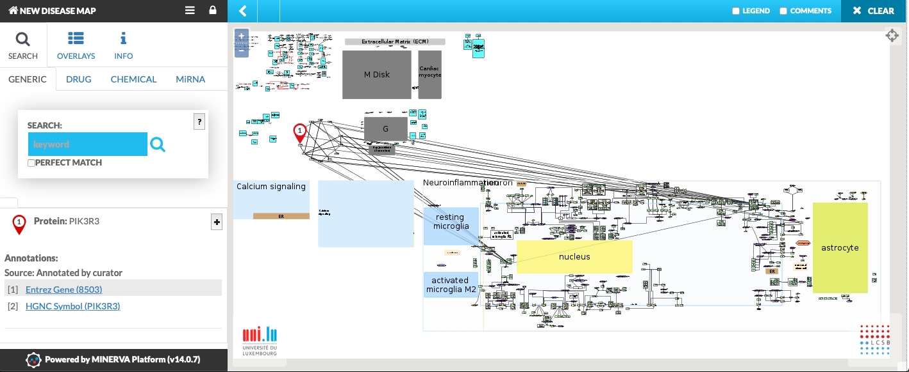

# Disease and pathway maps for Rare Diseases

## Authors
 - **Submitter and proponent:** Marek Ostaszewski
 - **Leads:** Marek Ostaszewski, Laura I. Furlong, Joaquin Dopazo
 - **Nominated participants:** Maria Pena Chilet, Piotr Gawron
 - **Participants:** Janet Pinero, Marina Esteban, Jose Luis Fernandez, David Hoksza, Vincenza Colonna

### LCSB, University of Luxembourg, Luxembourg
 - Piotr Gawron (0000-0002-9328-8052)
 - David Hoksza (0000-0003-4679-0557)
 - Marek Ostaszewski (0000-0003-1473-370X)

### University Pompeu Fabra, Barcelona, Spain
 - Laura I. Furlong (0000-0002-9383-528X)
 - Janet Pinero (0000-0003-1244-7654)

### Fundacion Progreso y Salud, Sevilla, Spain
 - Joaquin Dopazo (0000-0003-3318-120X)
 - Maria Pena Chilet (0000-0002-6445-9617)
 - Marina Esteban (0000-0003-2632-9587)
 - Jose Luis Fernandez ()

### Institute of Genetics and Biophysics, National Research Council of Italy
 - Vincenza Colonna (0000-0002-3966-0474)

## Abstract

## Introduction

Investigation of causal mechanisms behind Rare Diseases (RDs) is challenging, as these disorders are not prevalent enough to be represented in major bioinformatics resources or pathway databases. At the same time, a number of disease-focused resources are developed which could offer insights into specific rare diseases, if searched systematically. During BioHackathon'19 we based on an existing, rich, open source/open access infrastructure focused on disease-related mechanisms. We focused on repositories with well-defined APIs to facilitate their integration. 

We streamlined different tools and platforms to enable pan-resource searches for specific questions of the field of RD research. We based on standardized definitions and encoding of disease phenotypes, supported the search process with high-throughput data, whenever applicable. Using these searches, we retrieved genes and variants relevant for the disease mechanisms. Using these relevant genes and variants, we identified enriched, publicly available pathway databases and disease maps, together with text mining results, to combine them into a custom disease map, generated on-the-fly. This way, a researcher is able to define an RD of choice, or encode its phenotype, to generate a relevant disease map prototype for further refinement.

## Approach and resources

Our workflow can be subdivided into three, conceptually separate steps:

1. Getting data about the disease context for a given RD
2. Creating a network of known mechanisms from a set of selected repositories
3. Producing an online, interactive map prototype

All code is available in the open gitlab repository:  
[https://git-r3lab.uni.lu/david.hoksza/bh19-rare-diseases](https://git-r3lab.uni.lu/david.hoksza/bh19-rare-diseases)

### Disease context
In order to introduce disease context, we focused on two major resources: OrphaNet ([orpha.net](https://www.orpha.net)) and Human Phenotype Ontology (HPO) [PMID:27899602](https://www.ncbi.nlm.nih.gov/pubmed/27899602). Unique identifiers of OrphaNet allow to identify an RD, and if this disease is still not classified, it is possible to identify a proximal OrphaNet id by similarity of HPO terms.

For given OrphaNet identifiers, we obtained the list of relevant genes and variants by combining: i) gene-disease mapping of OrphaNet, ii) gene-disease and variant-disease mapping of DisGeNET [PMID:25877637](https://www.ncbi.nlm.nih.gov/pubmed/25877637) ([disgenet.org](https://www.disgenet.org)), iii) variant-disease mapping of OpenTargets platform [PMID:30462303](https://www.ncbi.nlm.nih.gov/pubmed/30462303) ([opentargets.org](https://www.opentargets.org)) and iv) variant-disease mapping of ClinVar ([www.ncbi.nlm.nih.gov/clinvar/](https://www.ncbi.nlm.nih.gov/clinvar/)). Importantly, disease-associated variants were filtered for rarity using population allele frequencies obtained from Ensembl Variant Effect Predictor (VEP) ([www.ensembl.org/info/docs/tools/vep/](https://www.ensembl.org/info/docs/tools/vep/)).

In parallel, for the same OrphaNet identifiers, we searched ArrayExpress [PMID:30357387 (https://www.ncbi.nlm.nih.gov/pubmed/30357387) ([www.ebi.ac.uk/arrayexpress/](https://www.ebi.ac.uk/arrayexpress/)) and Gene Expression Omnibus [PMID:27008011](https://www.ncbi.nlm.nih.gov/pubmed/27008011) ([www.ncbi.nlm.nih.gov/geo/](http://www.ncbi.nlm.nih.gov/geo/)) to retrieve a list of Differentially Expressed Genes (DEGs), to extend the the set of disease-associated genes.

### Network of mechanisms
The disease-relevant list of genes and variants was then used to construct a network of mechanisms using three different resources: disease maps, pathways and text mining.

Disease maps offer standardized and diagrammatic description of disease mechanisms [PMID:29872544](https://www.ncbi.nlm.nih.gov/pubmed/29872544), and with the help of Gene Set Enrichment Analysis can be queried for areas of significance for a given gene list [PMID:31074494](https://www.ncbi.nlm.nih.gov/pubmed/31074494). These areas can be exported together with their layout information, thanks to the capabilities of Systems Biology Markup Language (SBML) to support layout and render information, and functionalities of the MINERVA Platform [PMID:31273380](https://www.ncbi.nlm.nih.gov/pubmed/31273380).

Another set of resources that support building the network of mechanisms are pathway databases. They also offer diagrammatic description of mechanisms in molecular biology, but less relevant to a particular disease. Nevertheless, they area a valuable resource and can be evaluated using enrichment. We focused on WikiPathways [PMID:29136241](https://www.ncbi.nlm.nih.gov/pubmed/29136241) ([wikipathways.org](https://wikipathways.org)).

Finally, to fetch potentially novel interactions between the preselected genes, we used STRING [PMID:30476243](https://www.ncbi.nlm.nih.gov/pubmed/30476243) ([string-db.org](https://string-db.org/)). Importantly, a parallel project in BioHackathon'19 focused on "[Text-mining and semantic web technologies](https://github.com/elixir-europe/BioHackathon-projects-2019/tree/master/projects/11)", and we worked to incorporate their outcomes into our workflow. As most of text mining interactions are non-directional and may contain noise, we relied on the OmniPath resource [PMID:27898060](https://www.ncbi.nlm.nih.gov/pubmed/27898060) to increase reliability, and to obtain directionality and sign of interaction.

### Interactive prototype
As mentioned above, we chose SBML with render and layout to harmonize and integrate different resources, using the MINERVA Platform [PMID:28725475](https://www.ncbi.nlm.nih.gov/pubmed/28725475), and in particular its conversion capabilities [PMID:31074494](https://www.ncbi.nlm.nih.gov/pubmed/31074494). MINERVA was chosen as a platform to host the generated disease map, making it interactive and allowing to visually explore omics data.

To extend the use of the prototype disease map beyond visual exploration, we investigated Hipathia platform [PMID:31831811](https://www.ncbi.nlm.nih.gov/pubmed/31831811)([hipathia.babelomics.org](http://hipathia.babelomics.org/)), allowing to interpret gene expression and mutation data into perturbations of signaling pathways. We focused on interface between Hipathia and MINERVA to enable analysis of the disease map, and visualization of the analysis results.

## Results at the BioHackathon'19

### Step 1. Gathering disease-related genes and variants (seed genes)

To obtain the disease-associated genes and variants, the workflow implements scripts to query [DisGeNET](http://www.disgenet.org/), [OpenTargets](https://www.opentargets.org/) and [ClinVar](https://www.ncbi.nlm.nih.gov/clinvar/). 

Both DisGeNET and Open Targets scripts connect to the respective resources via their API and return a JSON file containing associated genes and their variants, including the association score provided by the respective platform. The scripts can be passed the required level of the association score and the maximum number of genes to be returned. The input to these scripts is a list of disease identifiers in the form of Orphanet identifiers. The Orphanet identifier is passed directly as query to Open Targets, however, DisGeNET requires UMLS identifier on its input and therefore [Ontology Lookup Service](https://www.ebi.ac.uk/ols/index) API is first called to translate the Orphanet identifiers to the corresponding UMLS identifieriers. All the parameters can be set in the workflow configuration files.

The list of genes and variants are then contrasted with ClinVar data which is provided as a preprocessed file. The script goes through the obtained genes and variants and carries out pairwise comparison of ClinVar non-pathogenic variants (and thus also genes) with the  DisGeNET and Open Targets genes and variants. The script outputs a combined list of genes and variants pertinent to given disease, but also a report showing the difference in representation of genes and variants across the resources. Additionally, the variants can be filtered by their allele frequency in several populations available in the [Ensembl](http://www.ensembl.org/index.html) database. This is done through the [Ensemble API endpoint](https://rest.ensembl.org/documentation/info/vep\_id\_post).

Finally, we scripted functions in R language to search microarrays datasets for a given rare disease in ArrayExpress and GEO databases. The user can select the organism of the datasets to be searched and filter the type/s of microarrays. Raw or normalized gene expression data can be downloaded, normalized and annotated using microarray annotation for each study. The user can choose between by study normalization or all studies as one batch normalization. Then, according to SD and QC analyses, samples are selected for the downstream processing, and, based on clinical metadata of the dataset, clinical variable is selected to assign samples to case/control groups. Finally, the script performs a meta-analysis using metaMA data and retrieves a list of differentially expressed genes (DEGs) for further analyses.

### Step 2. Assembly and extension of network of mechanisms
We expanded the number of disease-associated genes and variants (seed genes), assembled in previous steps, using resources as described above. The script receives as an input a list of seed genes (from OrphaNet, DisGeNET, OpenTargets and ClinVar) and expands the list of seed genes using information from different resources.

#### Disease maps
Disease maps hosted on MINERVA can be queried via API calls, and their content can be retrieved, including layout and network structure. We used Parkinson's disease map ([pdmap.uni.lu](https://pdmap.uni.lu)) as an example in our workflow. Nevertheless, source disease maps, if they are open access, can be set in configuration files of the workflow. For each selected disease map, the workflow performs Gene Set Enrichment Analysis for the seed genes (for GSEA in MINERVA see [PMID:31074494](https://www.ncbi.nlm.nih.gov/pubmed/31074494)) and indicates enriched areas for later integration.

#### Pathway databases
We used the ``enrichR`` package, an R-based interface to the Enrichr server ([PMID:27141961](https://www.ncbi.nlm.nih.gov/pubmed/27141961)) to calculate pathway enrichment for the seed genes. As ``enrichR`` allows for querying multiple packages at once, a configuration file (see below) allows to indicate, which pathway databases can be used. Currently, our workflow handles only the contents of Wikipathways.

#### Text mining nad interaction databases

**STRING**  
STRING integrates primary and predicted interactions, includes annotated pathway knowledge, text-mining results and data obtained by ontology. The query to STRING retrieves the first ``n`` neighbors of the seed genes. The number of neighbors can be adjusted by modifying the configuration of the workflow (see below). Moreover, the score for the associations among the seed proteins and the extended list of proteins can be set by modifying the parameter score in the configuration file. By default, the score equals zero.

**OmniPath**  
The query to OmniPath retrieves all associations in the database for the seed genes. The information from OmniPath includes directionality (values = 1 means direction, value=0 means no direction). The column ``consensus_directionality`` reflects the fact that some evidences might indicated the directionality to be from protein A to protein B for a given pair, and also from protein B to protein A. We also extracted from OmniPath the references supporting the relationship between the pairs of proteins. To the information from STRING, the information from OmniPath is added, to provide directionality to those pairs of proteins reported by both resources.

### Step 3. Integration of map pieces into a prototype
We implemented functionality to integrate all the pieces assembled in **Step 2**, namely disease map segments, pathways and text mining data. 

Disease map segments, identified via GSEA for the seed genes, were retrieved from respective disease maps. Because this content is hosted by MINERVA, these pieces have their layout and rendering information fully preserved.

MINERVA Platform (v15, currently in beta) is capable of importing and exporting GPML format, used by Wikipathways. This allows for programmatic handling of pathways enriched in **Step 2**. Because of the translation between two different layout and rendering descriptions, some details, e.g. custom images or interactions without reactant/product, are lost.

Text mining information has inherently no layout nor rendering information. For these elements, a circular layout was introduced.

The newly implemented functionality integrated the pieces from **Step 2** in a mesh-like layout. See image below for an example. In the image, Wikipathways content is in the upper part of the map, text mining results in the middle, and the content from disease maps at the bottom.

Moreover, we worked on an interface from MINERVA to a full pathway-based analysis and visualization of disease maps in HiPhathia web tool. The task is divided in back-end and front-end related work. The back-end was developed under the Java EE platform, using Java 11 and the Spring Framework plus Spring Batch for managing the job queue, and a Mongo database for data persistence. The front-end was prototyped using TypeScript and ReactJS.

**Back-end**  
First, a service with a RESTful interface takes an identifier from MINERVA Platform network and a RD expression dataset as inputs, decompresses and stores the files in a temporal folder and queues the files to the second service, returning a job identifier. Second, a Mongo and Spring Batch based service downloads MINERVA-hosted disease map using dedicated services, developed during the BioHackathon. The map is preprocessed for its use in HiPhathia web tool. Then, HiPathia algorithm for pathway-based analysis is executed as an R script. Finally, a HTTP server is prepared for the visualization of the results from HiPathia pathway-based analysis,with an URL based on the job identifier.

**Front-end**
We developed a web component for its inclusion in Hipathia Web (and possibly in MINERVA) allowing the user to upload experimental data and select a MINERVA disease map, execute the corresponding Hipathia analysis, and view the results.

### Step 4. Streamlining of the previous steps and configuration of the workflow

The workflow is implemented as a shell pipeline which can be configured by a parameters file where the user can set all the parameters mentioned above including the list of disease identifiers. The output of the pipeline is a ZIP file containing the disease map with genetic and variants overlays and can be imported into [MINERVA](https://minerva.pages.uni.lu/). The pipeline implements the above described steps in the following order:

1. Obtain gene-disease and variant-disease mapping from DisGeNET. 
2. Obtain gene-disease and variant-disease mapping from OpenTargets.
3. Obtain possibly pathogenic ClinVar variants and genes pertinent to given disease.
4. Compile list of of genes associated with disease from all the input sources.
5. Extend the list of genes by going to other resources such as OmniPath or text mining.
6. Compile list of of variants associated with disease from all the input sources.
7. Filter out variants with high allele frequency using Ensemble's VEP service.
8. Obtain variant information (position, protein-level mapping) and store it for MINERVA genetic variant overlay.
9. From resources such as existing disease maps or WikiPathways obtain enriched pathways 
with respect to the disease-associated genes obtained from previous step.
10. Compile the obtained pathways into a single disease map.
11. Bundle the disease map with genetic and variant overlays into a single archive to be then uploaded to [MINERVA](https://minerva.pages.uni.lu/).  

 ## Summary and outlook

 Notes for later:
 - SPARQL query to Wikipathways
 - Deeper integration with text mining service
